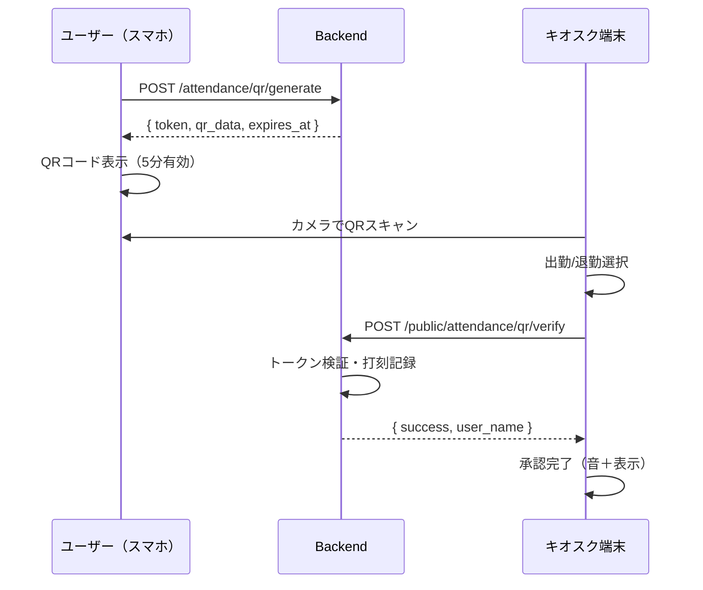
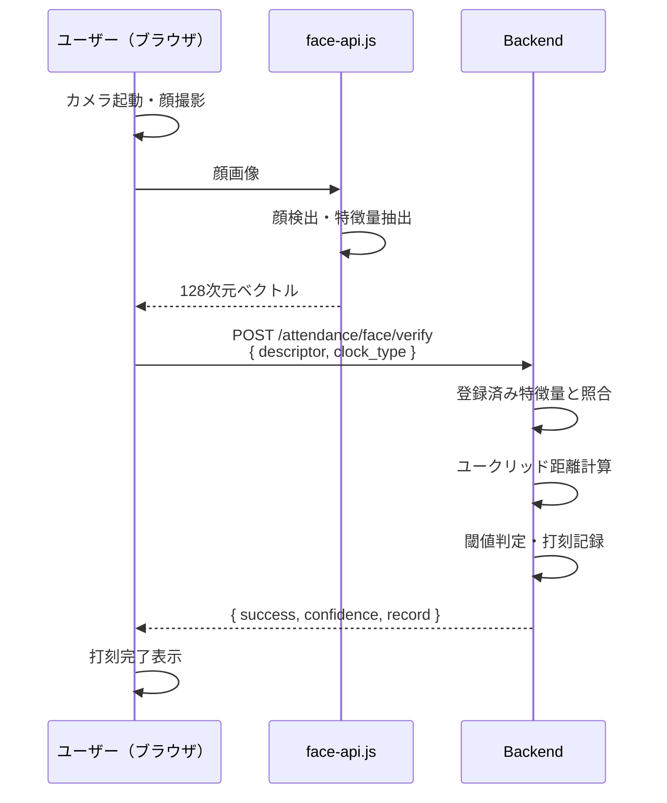

# 打刻方式フロー図（スライド補足資料）

スライド「12. 実装した打刻方式」の後に追加するフロー図の詳細資料です。

---

## QRコード打刻フロー

### シーケンス図

```
┌─────────────────────────────────────────────────────────────────────────────┐
│                        QRコード打刻フロー                                    │
└─────────────────────────────────────────────────────────────────────────────┘

【ユーザー側（スマートフォン）】          【管理者/キオスク端末】

    ┌─────────────┐
    │  ログイン   │
    └──────┬──────┘
           ▼
    ┌─────────────┐
    │ QRタブ選択  │
    └──────┬──────┘
           ▼
    ┌─────────────┐
    │ QRトークン  │  POST /attendance/qr/generate
    │   生成要求  │ ─────────────────────────────►  Backend
    └──────┬──────┘                                    │
           │                                          │
           │◄─────────────────────────────────────────┘
           │  { token, expires_at, qr_data }
           ▼
    ┌─────────────┐
    │  QRコード   │  ※5分間有効
    │    表示     │  ※1回限り使用可
    └──────┬──────┘
           │
           │  《カメラでスキャン》
           │
           ▼                              ┌─────────────┐
    ┌─────────────┐                       │ カメラ起動  │
    │             │                       │ QR読み取り  │
    │   QRコード  │ ◄────────────────────│             │
    │             │                       └──────┬──────┘
    └─────────────┘                              │
                                                 ▼
                                          ┌─────────────┐
                                          │ 出勤/退勤  │
                                          │  選択      │
                                          └──────┬──────┘
                                                 │
                                                 ▼
                                    POST /admin/attendance/qr/verify（認証済）
                                    POST /public/attendance/qr/verify（キオスク）
                                                 │
                                                 ▼
                                          ┌─────────────┐
                                          │  Backend    │
                                          │ ・トークン検証
                                          │ ・有効期限確認
                                          │ ・使用済みチェック
                                          │ ・打刻レコード作成
                                          └──────┬──────┘
                                                 │
           ┌─────────────────────────────────────┘
           ▼
    ┌─────────────┐                       ┌─────────────┐
    │  打刻完了   │                       │  承認完了   │
    │ （通知受信）│                       │ （音＋表示）│
    └─────────────┘                       └─────────────┘
```

### QRトークン仕様

| 項目 | 値 |
|------|-----|
| 有効期限 | 5分 |
| 使用回数 | 1回限り |
| データ形式 | JSON（type, token, clock_type, expires_at） |
| 認証方式 | トークン自体が認証（キオスク）/ JWT認証（管理者） |

### API エンドポイント

| エンドポイント | 認証 | 用途 |
|---------------|------|------|
| `POST /attendance/qr/generate` | 必要 | ユーザーがQRトークンを生成 |
| `POST /admin/attendance/qr/verify` | 必要（管理者） | 管理者がQRをスキャンして打刻承認 |
| `POST /public/attendance/qr/verify` | 不要 | キオスク端末でQRをスキャンして打刻 |

### 運用パターン

1. **対面確認パターン（管理者スキャン）**
   - 受付や入口に管理者が常駐
   - ユーザーのスマホQRを管理者がスキャン
   - 本人確認と打刻を同時に実施

2. **セルフサービスパターン（キオスク端末）**
   - 入口にタブレット端末を設置
   - ユーザーが自分でQRをかざす
   - 認証不要の公開APIを使用

---

## 顔認証打刻フロー

### 顔データ登録フロー（初回のみ）

```
    ┌─────────────┐
    │  ログイン   │
    └──────┬──────┘
           ▼
    ┌─────────────┐
    │ 設定画面    │
    │ 顔データ管理│
    └──────┬──────┘
           ▼
    ┌─────────────┐
    │ カメラ起動  │
    │ 顔を撮影    │
    └──────┬──────┘
           ▼
    ┌─────────────────────────────────┐
    │     face-api.js（ブラウザ内）    │
    │  ・顔検出（TinyFaceDetector）    │
    │  ・68点ランドマーク検出          │
    │  ・128次元特徴量ベクトル抽出     │
    └──────┬──────────────────────────┘
           │
           ▼
    ┌─────────────┐  POST /attendance/face/register
    │ 特徴量送信  │ ─────────────────────────────►  Backend
    │ （128次元） │                                    │
    └──────┬──────┘                                    │
           │                                          │
           │◄─────────────────────────────────────────┘
           │  { id, user_id, is_primary }
           ▼
    ┌─────────────┐
    │  登録完了   │
    └─────────────┘
```

### 顔認証打刻フロー

```
    ┌─────────────┐
    │  ログイン   │
    └──────┬──────┘
           ▼
    ┌─────────────┐
    │ 顔認証タブ  │
    │   選択      │
    └──────┬──────┘
           ▼
    ┌─────────────┐
    │ 出勤/退勤  │
    │   選択      │
    └──────┬──────┘
           ▼
    ┌─────────────┐
    │ カメラ起動  │
    │ 顔を撮影    │
    └──────┬──────┘
           ▼
    ┌─────────────────────────────────┐
    │     face-api.js（ブラウザ内）    │
    │  ・顔検出                        │
    │  ・128次元特徴量ベクトル抽出     │
    │  ・（オプション）生体検知        │
    └──────┬──────────────────────────┘
           │
           ▼
    ┌─────────────┐  POST /attendance/face/verify
    │ 特徴量送信  │ ─────────────────────────────►  Backend
    │ + clock_type│                                    │
    └──────┬──────┘                                    │
           │                            ┌──────────────┴──────────────┐
           │                            │  顔照合処理                  │
           │                            │  ・登録済み特徴量を取得      │
           │                            │  ・ユークリッド距離計算      │
           │                            │  ・閾値判定（距離 < 0.6）    │
           │                            │  ・信頼度スコア算出          │
           │                            │  ・打刻レコード作成          │
           │                            └──────────────┬──────────────┘
           │                                           │
           │◄──────────────────────────────────────────┘
           │  { success, confidence, record }
           ▼
    ┌─────────────┐
    │  打刻完了   │
    │ 信頼度表示  │
    └─────────────┘
```

### 顔認証技術仕様

| 項目 | 値 |
|------|-----|
| ライブラリ | face-api.js v0.22.2 |
| 特徴量次元 | 128次元（Float32） |
| 照合閾値 | ユークリッド距離 < 0.6 |
| 処理場所 | 顔検出・特徴量抽出はブラウザ内 |
| 保存データ | 特徴量ベクトルのみ（画像は保存しない） |
| 生体検知 | オプション（まばたき検出など） |

### API エンドポイント

| エンドポイント | 認証 | 用途 |
|---------------|------|------|
| `POST /attendance/face/register` | 必要 | 顔データ（特徴量）を登録 |
| `POST /attendance/face/verify` | 必要 | 顔認証を行い打刻 |
| `GET /attendance/face/status` | 必要 | 顔データ登録状況を確認 |
| `DELETE /attendance/face` | 必要 | 顔データを削除 |

### 顔照合アルゴリズム

```
信頼度 = 1 - ユークリッド距離

距離 0.0 → 信頼度 100%（完全一致）
距離 0.4 → 信頼度 60%（高い一致）
距離 0.6 → 信頼度 40%（閾値：これ以上は不一致）
距離 1.0 → 信頼度 0%（完全不一致）
```

### プライバシー配慮

- **画像非保存**: 顔画像はサーバーに送信・保存しない
- **特徴量のみ**: 128個のfloat値（数値配列）のみを保存
- **復元不可**: ベクトルから顔画像の復元は数学的に不可能
- **クライアント処理**: 顔検出・特徴量抽出はすべてブラウザ内で実行

---

## Mermaid形式（プレゼンツール用）

### QRコード打刻シーケンス図



### 顔認証打刻シーケンス図



---

## 話すポイント（発表用メモ）

### QRコード打刻について

- 「対面確認が必要な現場」と「セルフサービス」の両方に対応
- QRトークンは5分で期限切れ、1回限り使用可能でセキュリティ確保
- キオスク端末用の公開APIにより、タブレット設置だけで運用開始可能

### 顔認証打刻について

- **プライバシーファースト設計**: 顔画像は一切サーバーに送らない
- 128次元の数値ベクトルのみを保存、これから顔は復元できない
- face-api.jsによりブラウザ内で完結、サーバー負荷なし
- 照合閾値0.6は、他人を誤認識するリスクと本人を拒否するリスクのバランス
